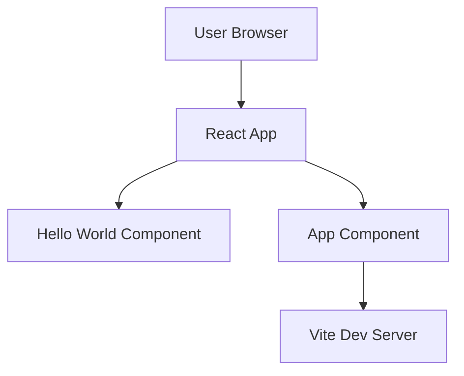

# Technical Specification: Customer Intelligence

## Metadata

- **Issue**: [#1 - Customer Intelligence React App](https://github.com/stillrivercode/customer-intelligence/issues/1)
- **Created**: 2025-07-07
- **Type**: Technical Specification
- **Status**: Draft

## Table of Contents

- [Overview](#overview)
- [System Architecture](#system-architecture)
- [Detailed Design](#detailed-design)
- [API Specifications](#api-specifications)
- [Security Considerations](#security-considerations)
- [Performance Requirements](#performance-requirements)
- [Testing Strategy](#testing-strategy)
- [Deployment Plan](#deployment-plan)
- [Implementation Progress](#implementation-progress)
- [Monitoring & Observability](#monitoring-observability)
- [Related Documents](#related-documents)
- [Issue Reference](#issue-reference)

## Overview

### Problem Statement

Create a customer intelligence React application named "app" located in the app/ directory with basic components and modern development setup. This serves as a foundation for building a customer intelligence dashboard with React best practices.

### Solution Summary

A customer intelligence React application named "app" in the app/ directory using modern development tools including Vite for build tooling, TypeScript for type safety, and a component-based architecture for customer intelligence dashboard features.

### Goals and Objectives

- **Primary Goal**: Create a working Customer Intelligence React application
- **Secondary Goals**: 
  - Establish modern development setup with Vite and TypeScript
  - Implement component-based architecture
  - Set up development and build workflows
- **Success Criteria**: Application renders customer intelligence dashboard foundation and can be built/deployed

### Assumptions and Constraints

- **Assumptions**: 
  - Node.js 18+ is available
  - Modern browser support (ES2020+)
  - Development team familiar with React
- **Constraints**: 
  - Must use React 18+
  - Should follow TypeScript best practices
  - Keep dependencies minimal for initial version
- **Dependencies**: Node.js, npm/yarn package manager

## System Architecture

### High-Level Architecture



### Component Overview

| Component | Responsibility | Technology |
|-----------|---------------|------------|
| App Component | Root application component | React + TypeScript |
| Hello World Component | Display greeting message | React Functional Component |
| Vite Build System | Development server and bundling | Vite |
| Type Definitions | Type safety and development experience | TypeScript |

### Data Flow

1. User accesses application in browser
2. Vite serves React application bundle
3. App component renders Hello World component
4. Hello World component displays greeting message

## Detailed Design

### Core Components

#### Component 1: App Component

**Purpose**: Root application component that manages the overall app structure

**Responsibilities**:
- Render the main application layout
- Import and render Dashboard component
- Manage global application state (future)

**Interfaces**:
- No props required (root component)
- Returns JSX element containing Dashboard component

#### Component 2: Dashboard Component

**Purpose**: Display the main customer intelligence dashboard

**Responsibilities**:
- Render customer intelligence dashboard layout
- Demonstrate basic React component structure
- Provide styling foundation for dashboard

**Interfaces**:
- Optional props for customizing message
- Returns JSX element

### Component Structure

```typescript
// App.tsx
const App: React.FC = () => {
  return (
    <div className="app">
      <Dashboard />
    </div>
  );
};

// Dashboard.tsx
interface DashboardProps {
  title?: string;
}

const Dashboard: React.FC<DashboardProps> = ({ 
  title = "Customer Intelligence Dashboard" 
}) => {
  return (
    <div className="dashboard">
      <h1>{title}</h1>
    </div>
  );
};
```

### Error Handling

- **Component Error Boundaries**: Not needed for basic dashboard
- **Build Errors**: Handled by TypeScript compiler and Vite
- **Runtime Errors**: Basic browser error handling

## API Specifications

### External API Integration

#### Stillriver API Service

**Base URL**: `https://api.stillriver.info`

**Authentication**: No API key required (public proxy service)

**Available Endpoints** (via API Ninjas proxy):
- **Finance**: Bitcoin, Currency, Stocks, Exchange Rate, Commodity Price (100 req/hour)
- **Internet**: DNS Lookup, IP Lookup, WHOIS, Domain Availability (500 req/hour)
- **Entertainment**: Company News, Facts, Trivia (1000 req/hour)
- **Places**: City data, Timezone, Geographic information (1000 req/hour)

**Rate Limiting**: Category-specific limits (50-1000 requests/hour)
**Caching**: Intelligent caching with TTL based on data volatility

### Component Props API

#### Dashboard Component

**Props Interface**:
```typescript
interface DashboardProps {
  title?: string;
  className?: string;
}
```

**Usage Example**:
```tsx
<Dashboard title="Welcome to Customer Intelligence" />
<Dashboard className="custom-styling" />
```

**Default Behavior**:
- `title`: Defaults to "Customer Intelligence Dashboard"
- `className`: No default class

## Security Considerations

### Client-Side Security

- **XSS Prevention**: React's built-in JSX escaping prevents XSS
- **Content Security Policy**: Basic CSP headers for development
- **Dependency Security**: Regular npm audit for vulnerabilities

### Development Security

- **Public API Access**: No API keys required for Stillriver proxy service
- **Rate Limiting**: Built-in rate limiting and caching through Stillriver proxy
- **CORS Handling**: Proxy service handles cross-origin requests
- **Build Security**: Vite handles secure bundling
- **Development Server**: HTTPS in development (future enhancement)

## Performance Requirements

### Performance Targets

| Metric | Target | Measurement Method |
|--------|--------|--------------------|
| Initial Load | < 2s | Lighthouse |
| First Contentful Paint | < 1s | Web Vitals |
| Bundle Size | < 100KB | Webpack Bundle Analyzer |

### Optimization Strategies

- **Code Splitting**: Not needed for Hello World
- **Tree Shaking**: Vite handles automatically
- **Asset Optimization**: Vite optimizes assets

## Testing Strategy

### Unit Testing

- **Framework**: Vitest (Vite's testing framework)
- **Coverage Target**: 80%+
- **Test Categories**: Component rendering, props handling

### Pre-commit Testing

The project includes comprehensive pre-commit hooks that automatically run React application tests:

- **React App Tests**: Runs `npm test -- --run` for all React component changes
- **React App Build**: Validates production build for React code changes  
- **React App Lint**: Runs ESLint on React application files
- **Package Lock Validation**: Ensures package-lock.json consistency

### Testing Examples

```typescript
// Dashboard.test.tsx
import { render, screen } from '@testing-library/react';
import Dashboard from './Dashboard';

test('renders dashboard title', () => {
  render(<Dashboard />);
  const element = screen.getByRole('heading', { name: /customer intelligence dashboard/i });
  expect(element).toBeInTheDocument();
});

test('renders custom title', () => {
  render(<Dashboard title="Custom Dashboard" />);
  const element = screen.getByText(/custom dashboard/i);
  expect(element).toBeInTheDocument();
});
```

### Automated Quality Assurance

Pre-commit hooks ensure code quality by automatically running:
1. **Tests**: All React component tests must pass before commit
2. **Build**: Production build must succeed for code changes
3. **Linting**: Code must pass ESLint rules  
4. **Dependencies**: Package lock files must be synchronized

## Deployment Plan

### Build Strategy

- **Build Tool**: Vite
- **Output**: Static files (HTML, CSS, JS)
- **Target**: Modern browsers with ES2020 support

### Deployment Options

| Environment | Method | Configuration |
|-------------|--------|---------------|
| Development | Vite dev server | Local port 5173 |
| Staging | Static file hosting | Build artifacts |
| Production | CDN deployment | Optimized build |

### Build Commands

```bash
# Development
npm run dev

# Build for production
npm run build

# Preview production build
npm run preview
```

## Implementation Progress

**Instructions for the AI:** As you implement the features described in this specification, please update this section with your progress. Use checkboxes to mark completed tasks.

### Implementation Checklist
- [x] **Task 1:** Set up Vite + React + TypeScript project structure
- [x] **Task 2:** Create App component with basic layout
- [x] **Task 3:** Create Dashboard component with props interface
- [x] **Task 4:** Add basic CSS styling
- [x] **Task 5:** Set up testing framework and write basic tests
- [x] **Task 6:** Configure build and development scripts
- [x] **Task 7:** Add type definitions and ensure TypeScript compliance

### Notes & Blockers
*No current blockers for basic Customer Intelligence dashboard implementation.*

## Monitoring & Observability

### Development Monitoring

- **Hot Module Replacement**: Vite provides instant updates
- **TypeScript Checking**: Real-time type error reporting
- **Console Logging**: Browser developer tools

### Build Monitoring

- **Build Success**: Exit codes from npm run build
- **Bundle Analysis**: Vite build output shows bundle sizes
- **Type Checking**: TypeScript compilation success

## Related Documents

### User Stories

- [Related user stories for Customer Intelligence React App]

### Architecture Documents

- [System Architecture Overview](../docs/architecture.md)
- [React Development Guidelines](../docs/react-guidelines.md)

### Operational Documents

- [Deployment Guide](../docs/deployment.md)
- [Development Setup](../docs/development.md)

## Issue Reference

**GitHub Issue**: [#1 - Customer Intelligence React App](https://github.com/stillrivercode/customer-intelligence/issues/1)

### Original Description

Create a customer intelligence React application named 'app' located in the app/ directory with basic components and modern development setup for building a customer intelligence dashboard

### Labels

- None

### Workflow Integration

- 📝 **Manual**: Add 'ai-task' label to trigger AI implementation
- 👥 **Assignment**: Assign to team members for manual implementation
- 📋 **Tracking**: Add to project boards and milestones

---

**Generated**: 2025-07-07
**Tool**: create-spec
**Repository**: customer-intelligence
**Workflow**: Manual Technical Specification Creation